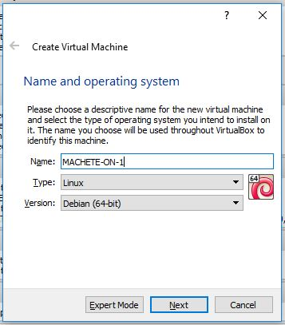
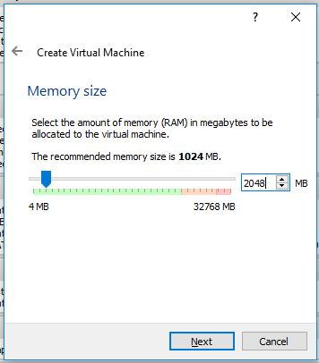
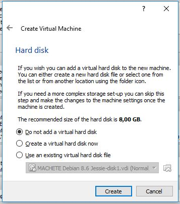
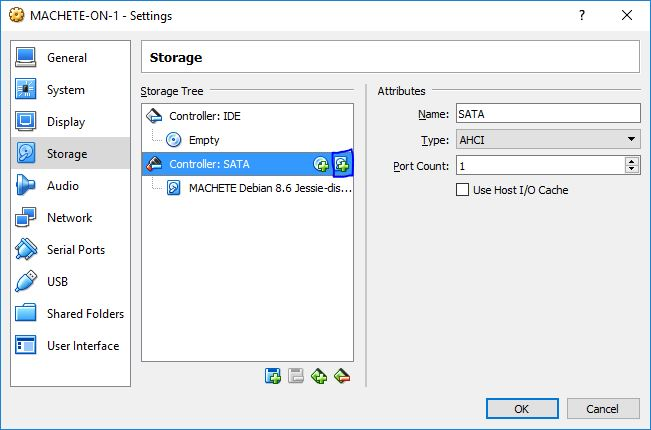
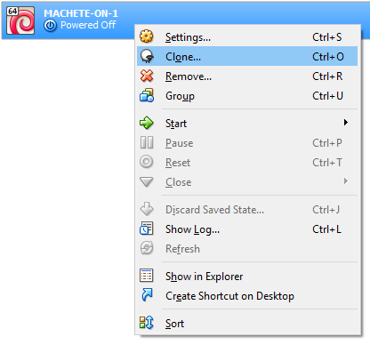
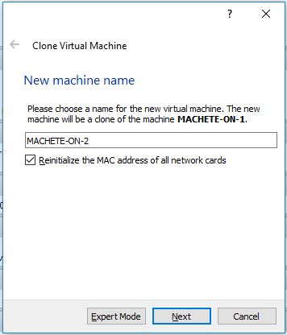
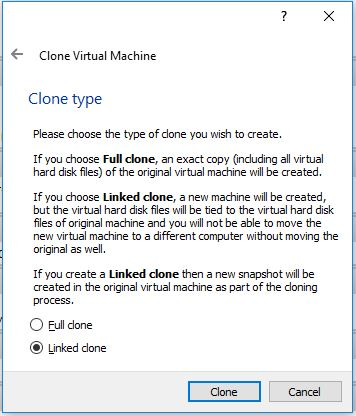
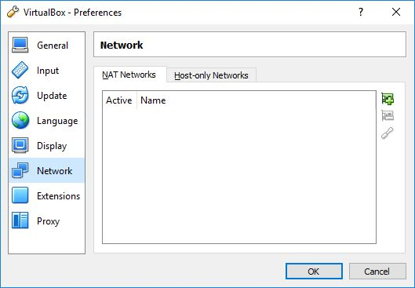
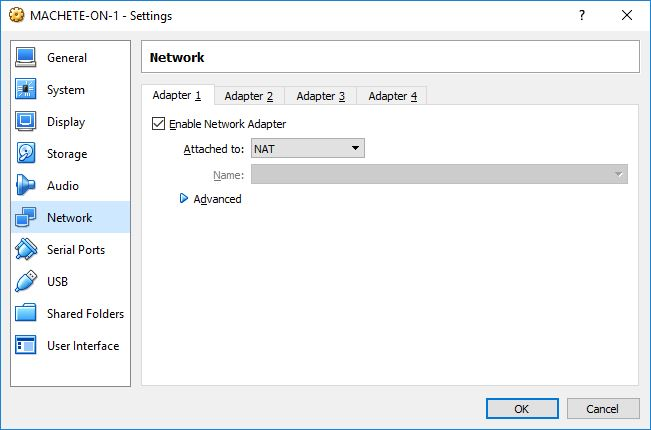
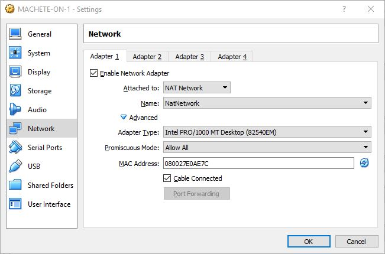

#Creating a Virtual Machine

In this tutorial we will describe how to run a demonstration example of PREMIUM using [Virtual Box](https://www.virtualbox.org). For this guide we will need 5 virtual machines to simulate 5 distributed components of MACHETE: a sender, a receiver, a multipath manager to store information about the network and two overlay nodes to forward traffic through different routes. The virtual machines use this [virtual disk](http://www.gsd.inesc-id.pt/~dmatos/safe-cloud/MACHETE_Debian_8.6_Jessie.zip).


To start let us create one virtual machine. To do so, in Virtual Box click in “**New**”, then choose a name for one of the components (for instance, MACHETE-ON-1, where ON stands for Overlay Node). The type of the virtual machine is **Linux** and the version **Debian (64-bit)**. 



For memory size choose at least 1024 MB.




Chose “**Do not add a virtual hard disk**”. The disk will be added later.




Now, let us import the disk of MACHETE (it is in VDI format and is accessible in the link at the start of this document and the password for the Zip file is “**SafeCloud**”). To do so, right click on the newly created VM and in the **Storage** tab click on the plus sign to add the VDI.




Now we have a virtual image that is the base for each component of   MACHETE. We need 5 copies of this base image:

 * MACHETE-S: the sender machine (S stands for Sender);
 * MACHETE-R: the receiver machine (R for Receiver);
 * MACHETE-ON-1 and;
 * MACHETE-ON-2: overlay nodes that allow directing slices of the traffic through different paths (ON stands for Overlay Node).
 * MACHETE-MPM: the multipath manager that stores information of each component (MPM stands for Multi-Path Manager).

Repeat the following steps for each copy of the base virtual image.

Right click on the base image and then click in “**Clone**”.




Give it the name of the component a choose to reinitialize the MAC address:




For the clone type chose “Linked clone”, so it will not occupy too much storage in your machine. This option uses differential disk files that only store the differences compared with the original disk file.



Once you’re done you can start the components of MACHETE.

The accounts credentials are the following:

```
Username: debian
Password: debian
Root Account Password: root
```

These choices of passwords are not secure and are only intended for the demonstration. For any actual deployment of MACHETE they should be changed to hard to guess passwords.
Network configuration
It is necessary to configure a network so that each component has its own IP address and they have access to the Internet. The option of VirtualBox that is most suited for these requirements is “NAT Network”.

First, let us create a “NAT Network” that will be used by MACHETE. To do so go to **File -> Preferences** and in the **Network** tab click the “**plus**” button to create and name a new “NAT Network”.






Then repeat the following steps for each virtual machine created. Please note that the sender (MACHETE-S) requires 2 network adapters (Adapter 1 and Adapter 2), so do these steps twice in this virtual machine.

First right-click in a virtual machine and then **Settings**. Then, in the network tab, fill in the requested values like in the image bellow:



